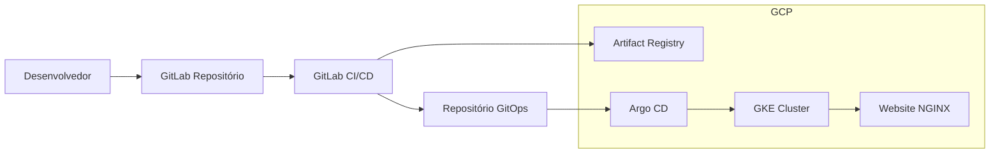

# 🌀 gke-gitops-pipeline

Projeto de automação GitOps utilizando Google Kubernetes Engine (GKE), ArgoCD e GitLab CI/CD. O projeto demonstra uma pipeline completa de build, versionamento e deploy automatizado com infraestrutura como código via Terraform.

---

## 📌 Stack Utilizada

- ☁️ **Google Cloud Platform (GCP)**
  - GKE, VPC, NAT Gateway, IAM
- 🧱 **Terraform** – Infraestrutura como Código
- 🐳 **Docker** – Build de imagens
- 📦 **Kubernetes** – Deploy e orquestração
- 🚀 **ArgoCD** – GitOps com sincronização contínua
- 🔁 **GitLab CI/CD** – Pipelines de build e GitOps automation
- 🌐 **NGINX** – Aplicação de exemplo (web estática)

---

## 🎯 Objetivos

- ✅ Aprender e aplicar o básico de **Terraform**, **GKE**, **GitOps** e **CI/CD**
- ✅ Demonstrar boas práticas de versionamento, automação e segurança
- ✅ Criar uma **pipeline reprodutível** para qualquer aplicação containerizada
- ✅ Usar **Git como fonte da verdade** em um fluxo GitOps real

---

## 🌍 Arquitetura

> Fluxo resumido baseado na imagem:



---

## 📁 Estrutura de Repositórios

- **Repositório 1 – App (CI):**  
  Contém aplicação `nginx` + Dockerfile + pipeline `.gitlab-ci.yml`  
  Responsável por build e update do GitOps repo

- **Repositório 2 – GitOps:**  
  Contém os **manifests do Kubernetes**, versionados e monitorados pelo **ArgoCD**

---

## ⚙️ Provisionamento da Infraestrutura

### Com Terraform

```bash
cd terraform/
terraform init
terraform plan
terraform apply
```

> Infraestrutura provisionada:
> - VPC, Subnets, NAT Gateway
> - Cluster GKE com RBAC
> - Roles e permissões IAM

---

## 🚀 Pipeline GitOps (CI/CD)

### 1. Build e Push da imagem

- Dockerfile com `nginx` (web estática)
- Build no GitLab Runner
- Push para o **Artifact Registry**

### 2. Atualização automática do GitOps repo

- Script do pipeline faz commit no repositório GitOps com nova imagem/tag

### 3. ArgoCD realiza sincronização

- O ArgoCD detecta mudanças e aplica automaticamente no GKE

---

## 🌐 Deploy Final

A aplicação é disponibilizada via **LoadBalancer** do GKE:

```
http://<EXTERNAL-IP>
```

---

## 🧠 Conceitos aplicados

- [x] GitOps com ArgoCD (pull-based)
- [x] Deploy contínuo via GitLab CI/CD
- [x] Build e versionamento de containers
- [x] Terraform para IaC
- [x] Boas práticas de separação de ambientes
- [x] Git como fonte da verdade para infraestrutura e deploy

---

## 🔐 Segurança e Boas Práticas

- IAM mínimo necessário via Terraform
- Segredos armazenados fora do Git
- Pipeline com validação de imagem e ambiente
- Controle de acesso via RBAC no GKE e ArgoCD

---

## 📄 Licença

Este projeto está sob a licença MIT. Veja `LICENSE` para mais detalhes.

---

## 🙋‍♂️ Autor

**Vitor Hugo de Sousa Santos**  
[LinkedIn](https://www.linkedin.com/in/seu-linkedin)  
[Email](mailto:seu@email.com)
